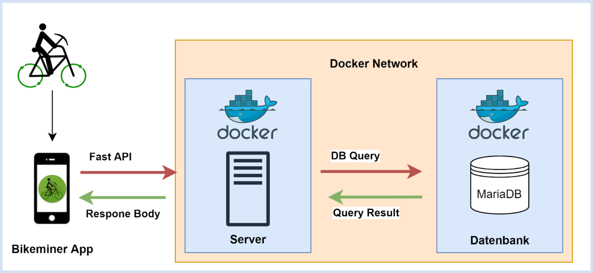

# Bikeminer
This repository is for the advanced software engineering lecture 2022 at DHBW-Mannheim

## Getting Started
1. [Download](https://developer.android.com/studio) & [Install](https://developer.android.com/studio/install) AndroidStudio
2. Clone this repository "https://github.com/Software-Engineering-DHBW/bikeminer.git"
3. Open cloned repository in AndroidStudio
4. Connect Android Smartphone with Computer or create/add a virtual Device per AndroidStudio's Device Manager
    - **Attention:** Device must support Google Play Services
    - Older Devices may need to perform a Google Services Update first
5. Run [Bikeminer-App](https://github.com/Software-Engineering-DHBW/bikeminer/tree/main/BikeMiner-app#readme)
6. Run mariaDB-Database in a [Docker-Container](https://github.com/Software-Engineering-DHBW/bikeminer/blob/main/api_bikeminer/README.md) 

## Systemarchitecture

